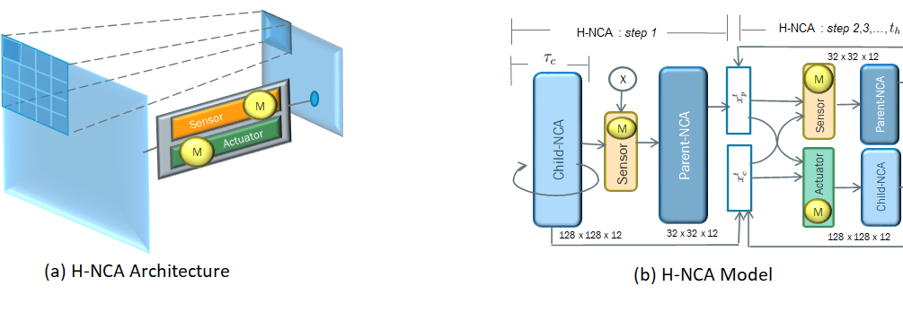

# Hierarchical Neural Cellular Automata

   

  
This repository contains all necessary code, images, model weights and colab file to reproduce the results in the paper:  
  
**Hierachical Neural Cellular Automata**  
Ritu Pande, Daniele Grattarola  

## Experiments

There are two experiments performed to show the capabilities of H-NCA, namely, <b> <i> Cell Differentiation </i> </b>  and  <b> <i> Metamorphosis </i> </b>. Cell Differentiation involves morphing of the patterns generated by the child-NCA to the patterns required by the parent-NCA while Metamorphosis involves descruction of the patterns generated by the child-NCA and the morphology required by the parent-NCA takes over.

## Results
### Cell Differentiation

### Metamomorphosis

## Results Reproduction
To reproduce the results of the paper, open **hnca.ipynb** from the repository in Google Colab and load the model weights. Then evolve the model using those weights. You can also train the models afresh following the instructions in the notebook.
